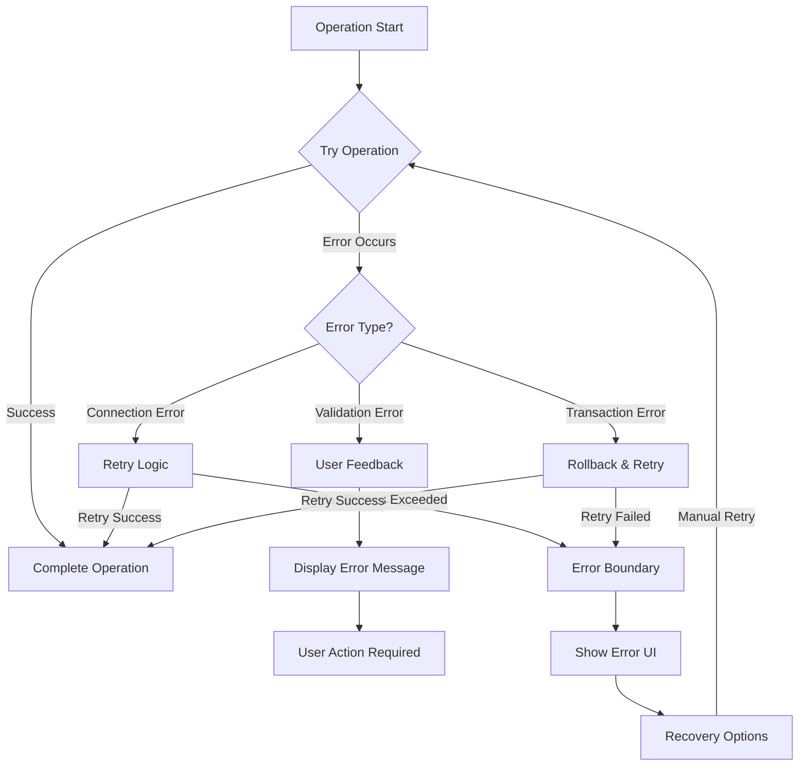

# Error Handling Standards

## Quick Start Guide

### 1. Basic Error Handling

```typescript
import { ErrorMessage, DatabaseErrorBoundary } from '@/components';
import { withRetry } from '@/lib/utils';

// 1. Wrap database-dependent components
function MyComponent() {
  return (
    <DatabaseErrorBoundary>
      <DataComponent />
    </DatabaseErrorBoundary>
  );
}

// 2. Use retry logic for operations
async function fetchData() {
  return withRetry(async () => {
    // Your database operation
  });
}

// 3. Display errors
function ErrorDisplay({ error }) {
  return <ErrorMessage error={error} />;
}
```

### 2. Common Error Patterns

```typescript
// Handle duplicate votes
try {
  await submitVote(voteData);
} catch (error) {
  if (error instanceof DuplicateVoteError) {
    showMessage('You have already voted for this logo');
  }
}

// Handle connection issues
try {
  await withRetry(async () => await connectToDatabase(), { maxRetries: 3 });
} catch (error) {
  showError('Unable to connect. Please check your connection.');
}
```

### 4. Type Safety and Runtime Checks

```typescript
// Always check for undefined before using Object.entries
function processSchema(schema: Schema | undefined) {
  if (!schema?.paths) {
    throw new Error('Invalid schema: missing paths');
  }

  return Object.entries(schema.paths).map(([key, path]) => {
    // Process schema paths safely
  });
}

// Use type guards for safer error handling
function isMongooseError(error: unknown): error is Error & { code?: string } {
  return error instanceof Error && 'code' in error;
}

try {
  await operation();
} catch (error) {
  if (isMongooseError(error) && error.code === 11000) {
    // Handle duplicate key error
  }
}
```

### 5. Safe Model Operations

```typescript
// Type-safe model initialization
function initializeModel<T extends Document, M extends Model<T>>(
  name: string,
  schema: Schema<T>
): M {
  return (mongoose.models[name] ||
    mongoose.model<T, M>(name, schema)) as M;
}

// Safe schema access
function getSchemaFields(schema: Schema | undefined): string[] {
  if (!schema?.paths) {
    return [];
  }
  
  return Object.keys(schema.paths);
}
```

## Overview

This document outlines our standardized approach to error handling across the application. We use a hierarchical system of error types, severities, and categories to provide consistent error handling and user feedback.

## Error Classification

### Severity Levels

```typescript
enum ErrorSeverity {
  FATAL, // Unrecoverable errors requiring app restart
  CRITICAL, // Severe errors that might be recoverable
  ERROR, // Standard errors
  WARNING, // Non-critical issues
  INFO, // Informational messages
}
```

### Error Categories

```typescript
enum ErrorCategory {
  CONNECTION, // Database connection issues
  NETWORK, // Network-related errors
  API, // API-related errors
  VALIDATION, // Data validation errors
  AUTH, // Authentication/Authorization errors
  DATA, // Data integrity/consistency errors
  SYSTEM, // System/Application errors
}
```

## Components

### 1. ErrorMessage Component

A reusable component for displaying error messages with:

- Severity-based styling
- Category-specific icons
- Action buttons for recoverable errors
- Inline and block display options

Usage example:

```typescript
<ErrorMessage
  error={error}
  showIcon={true}
  showAction={true}
  inline={false}
/>
```

### 2. DatabaseErrorBoundary

A specialized error boundary for handling database-related errors:

- Catches and handles database errors gracefully
- Uses ErrorMessage for consistent error display
- Supports custom fallback UI
- Provides error logging

Usage example:

```typescript
<DatabaseErrorBoundary>
  <YourDatabaseDependentComponent />
</DatabaseErrorBoundary>
```

## Error Types

### Base Error Class

```typescript
class VoteError extends Error {
  constructor(
    message: string,
    public code: string,
    public details?: any
  ) {
    super(message);
    this.name = 'VoteError';
  }
}
```

### Specialized Error Types

1. **DuplicateVoteError**

   - For duplicate vote attempts
   - Includes user ID, logo ID, and original vote ID

2. **InvalidVoteError**

   - For invalid vote data
   - Includes validation details

3. **TransactionError**
   - For database transaction failures
   - Includes transaction details

## Error Handling Utilities

### 1. Retry Logic

```typescript
interface RetryOptions {
  maxRetries?: number;
  baseDelay?: number;
  maxDelay?: number;
  timeout?: number;
}

async function withRetry<T>(operation: () => Promise<T>, options?: RetryOptions): Promise<T>;
```

Features:

- Exponential backoff with jitter
- Configurable retry attempts
- Operation timeout
- Error type-based retry decisions

### 2. Error Metadata

Each error type has associated metadata:

```typescript
interface ErrorMetadata {
  severity: ErrorSeverity;
  category: ErrorCategory;
  recoverable: boolean;
  userMessage: string;
  technicalDetails?: string;
  icon?: string;
  action?: {
    label: string;
    handler: () => void;
  };
}
```

## Best Practices

1. **Error Creation**

   ```typescript
   throw new InvalidVoteError('Invalid vote data', {
     userId,
     logoId,
   });
   ```

2. **Error Handling**

   ```typescript
   try {
     await withRetry(async () => {
       // Database operation
     });
   } catch (error) {
     if (error instanceof DuplicateVoteError) {
       // Handle duplicate vote
     } else if (error instanceof InvalidVoteError) {
       // Handle invalid vote
     } else {
       // Handle unknown error
     }
   }
   ```

3. **Transaction Error Handling**

   ```typescript
   const session = await mongoose.startSession();
   try {
     session.startTransaction();
     // Transaction operations
     await session.commitTransaction();
   } catch (error) {
     await session.abortTransaction();
     throw new TransactionError('Transaction failed', error);
   } finally {
     await session.endSession();
   }
   ```

## Best Practices for Error Prevention

1. **Type Safety**
   - Use TypeScript's strict mode
   - Add type guards for runtime checks
   - Validate data before operations

2. **Null Checks**
   - Always check for undefined/null values
   - Use optional chaining and nullish coalescing
   - Provide default values when appropriate

3. **Error Boundaries**
   - Implement component-level error boundaries
   - Handle both sync and async errors
   - Provide meaningful error messages

```typescript
class DatabaseErrorBoundary extends React.Component<Props, State> {
  static getDerivedStateFromError(error: Error) {
    return { hasError: true, error };
  }

  componentDidCatch(error: Error, errorInfo: React.ErrorInfo) {
    // Log error to monitoring service
    logError(error, errorInfo);
  }

  render() {
    if (this.state.hasError) {
      return <ErrorMessage error={this.state.error} />;
    }
    return this.props.children;
  }
}
```

## Error Recovery Strategies

1. **Connection Errors**

   - Automatic retry with exponential backoff
   - User-friendly connection status messages
   - Manual retry option for users

2. **Validation Errors**

   - Clear error messages
   - Input field highlighting
   - Suggested corrections

3. **Transaction Errors**
   - Automatic rollback
   - Retry with fresh transaction
   - Data consistency checks

## Monitoring and Logging

1. **Error Logging**

   ```typescript
   componentDidCatch(error: Error, errorInfo: React.ErrorInfo) {
     console.error('Error:', {
       name: error.name,
       message: error.message,
       stack: error.stack,
       info: errorInfo
     });
   }
   ```

2. **Health Checks**
   - Periodic database connection checks
   - Data consistency validation
   - Error rate monitoring

## UI Guidelines

1. **Error Messages**

   - Clear, non-technical language
   - Action-oriented solutions
   - Consistent styling based on severity

2. **Recovery Actions**
   - Clear call-to-action buttons
   - Automatic retry when appropriate
   - Manual retry options when needed

## Testing

1. **Error Simulation**

   ```typescript
   it('should handle connection errors', async () => {
     // Simulate connection error
     mockDb.simulateError('ECONNREFUSED');

     // Verify error handling
     await expect(operation()).rejects.toThrow(ConnectionError);
   });
   ```

2. **Boundary Testing**

   ```typescript
   it('should catch and handle database errors', () => {
     render(
       <DatabaseErrorBoundary>
         <ComponentThatThrows />
       </DatabaseErrorBoundary>
     );

     // Verify error display
     expect(screen.getByText(/database error/i)).toBeInTheDocument();
   });
   ```

## Troubleshooting Guide

### Common Issues and Solutions

1. **Connection Timeouts**

   ```typescript
   Error: ECONNREFUSED;
   ```

   - Check database connection string
   - Verify network connectivity
   - Check if database service is running
   - Try increasing connection timeout

2. **Duplicate Vote Errors**

   ```typescript
   DuplicateVoteError: User has already voted
   ```

   - Check user's voting history
   - Clear browser cache if needed
   - Verify vote status in database

3. **Transaction Failures**

   ```typescript
   TransactionError: Transaction failed
   ```

   - Check for concurrent operations
   - Verify collection locks
   - Check transaction timeout settings

### Debug Strategies

1. **Enable Detailed Logging**

   ```typescript
   // In development
   const DEBUG = true;

   if (DEBUG) {
     console.debug('Operation details:', {
       userId,
       operation,
       timestamp: new Date(),
     });
   }
   ```

2. **Test Connection Health**

   ```typescript
   async function checkHealth() {
     try {
       await mongoose.connection.db.admin().ping();
       return true;
     } catch (error) {
       console.error('Health check failed:', error);
       return false;
     }
   }
   ```

3. **Monitor Error Patterns**

   ```typescript
   const errorCounts = new Map<string, number>();

   function trackError(error: Error) {
     const count = errorCounts.get(error.name) || 0;
     errorCounts.set(error.name, count + 1);

     if (count > 10) {
       notifyAdmin(`High error rate for ${error.name}`);
     }
   }
   ```

### Performance Considerations

1. **Retry Backoff**

   - Start with short delays (1s)
   - Use exponential backoff
   - Add random jitter
   - Set maximum retry limit

2. **Cache Management**

   - Clear relevant caches after errors
   - Implement stale-while-revalidate
   - Use cache versioning

3. **Resource Cleanup**
   - Always close sessions
   - Release database connections
   - Clear temporary data

## Error Handling Flow



## Real-World Examples

### 1. Vote Submission Flow

```typescript
// From src/app/actions.ts
export async function submitVote(voteData: { userId: string; logoId: string; ownerId?: string }) {
  return withRetry(async () => {
    let session;
    try {
      await connectDB();
      session = await mongoose.startSession();
      session.startTransaction();

      // Validate user exists
      let user = await UserModel.findByUserId(voteData.userId).session(session);
      if (!user) {
        throw new InvalidVoteError('User not found');
      }

      // Check for duplicate vote
      if (!user.canVote(voteData.logoId)) {
        throw new DuplicateVoteError(user.userId, voteData.logoId, 'existing-vote');
      }

      // Process vote
      const vote = new VoteModel({
        userId: user.userId,
        logoId: voteData.logoId,
        timestamp: new Date(),
        status: DB_CONSTANTS.VOTE_STATUS.PENDING,
      });

      await vote.save({ session });
      await session.commitTransaction();
      return vote;
    } catch (error) {
      if (session?.inTransaction()) {
        await session.abortTransaction();
      }
      throw error;
    } finally {
      if (session) {
        await session.endSession();
      }
    }
  });
}
```

### 2. Database Connection Handling

```typescript
// From src/lib/mongodb.ts
async function connectDB() {
  try {
    if (cached?.conn) {
      if (cached.conn.readyState === 1) {
        return cached.conn;
      }
      cached.conn = null;
      cached.promise = null;
    }

    cached!.promise = withRetry(createConnection, {
      maxRetries: 5,
      baseDelay: 1000,
      maxDelay: 10000,
    });

    cached!.conn = await cached!.promise;
    return cached!.conn;
  } catch (error) {
    console.error('Failed to establish MongoDB connection:', error);
    throw new Error('Database connection failed');
  }
}
```

### 3. Error Boundary Usage

```typescript
// From src/app/page.tsx
export default function Vote() {
  return (
    <ErrorBoundary>
      <DatabaseErrorBoundary>
        <Suspense fallback={<LoadingFallback />}>
          <main className={styles.main}>
            <LogoGrid
              logos={logos}
              onLogoSelect={handleLogoSelection}
            />
            <VoteHistory
              voteHistory={voteHistory}
            />
          </main>
        </Suspense>
      </DatabaseErrorBoundary>
    </ErrorBoundary>
  );
}
```

## External Documentation

### MongoDB Resources

- [MongoDB Error Codes](https://www.mongodb.com/docs/manual/reference/error-codes/)
- [MongoDB Node.js Driver Error Handling](https://www.mongodb.com/docs/drivers/node/current/fundamentals/error-handling/)
- [Mongoose Error Handling](https://mongoosejs.com/docs/middleware.html#error-handling)

### React Resources

- [React Error Boundaries](https://react.dev/reference/react/Component#catching-rendering-errors-with-an-error-boundary)
- [Error Boundary Testing](https://legacy.reactjs.org/docs/testing-recipes.html#error-boundaries)

### TypeScript Resources

- [TypeScript Error Handling](https://www.typescriptlang.org/docs/handbook/error-handling.html)
- [Custom Error Types](https://www.typescriptlang.org/docs/handbook/2/classes.html#error-handling)

## Changelog

### Version 2.0.0 (Current)

- Added hierarchical error classification system
- Implemented ErrorMessage component with severity-based styling
- Added DatabaseErrorBoundary for database error handling
- Introduced retry logic with exponential backoff
- Added comprehensive error metadata system
- Implemented error tracking and monitoring

### Version 1.1.0

- Added basic error boundary implementation
- Introduced simple retry mechanism
- Added transaction error handling
- Basic error logging implementation

### Version 1.0.0

- Initial error handling implementation
- Basic try-catch blocks
- Simple error messages
- Basic transaction rollback
